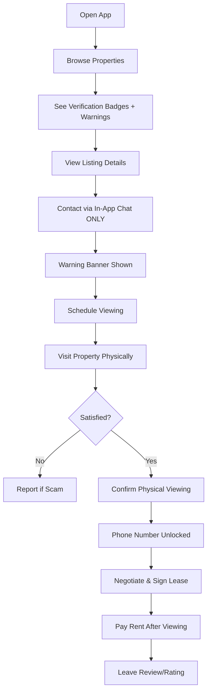
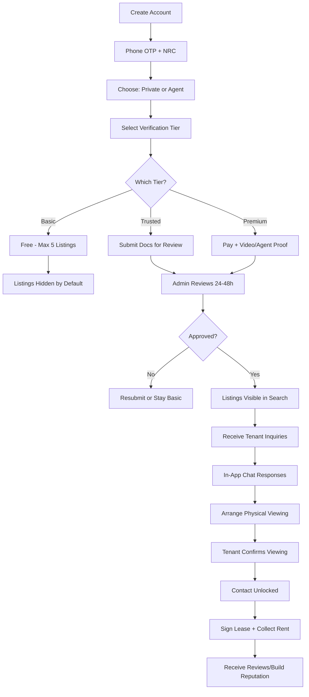

# Rental App - Business Process Documentation

> **Last Updated**: 2026-01-04  
> **Market**: Zambia  
> **Primary Challenge**: Preventing rental scams (Facebook/WhatsApp fraud)

---

## Table of Contents
1. [Executive Summary](#executive-summary)
2. [Core Principles](#core-principles)
3. [Fraud Prevention System](#fraud-prevention-system)
4. [User Flows](#user-flows)
5. [Marketing Strategy](#marketing-strategy)
6. [Monetization Model](#monetization-model)
7. [Technical Implementation](#technical-implementation)

---

## Executive Summary

This rental platform addresses the critical problem of rental fraud in Zambia, particularly scams originating from Facebook and WhatsApp. Our approach combines **tiered verification**, **payment security**, **community trust**, and **education** to create a safe marketplace for tenants and legitimate landlords.

### Key Differentiators
- ✅ **No upfront payments outside the app**
- ✅ **Tiered landlord verification system**
- ✅ **Community-driven fraud reporting**
- ✅ **In-app communication controls**
- ✅ **Photo authenticity verification**

---

## Core Principles

### 🛡️ Safety First
**Rule #1**: Never allow direct payments before physical property viewing  
**Rule #2**: Delay personal contact details until verification  
**Rule #3**: Trust is earned through verification badges and reputation

### 💰 Landlord Revenue, Not Tenant Fees
- Tenants browse and connect **for free**
- Landlords pay for premium features and verification
- No viewing fees, booking fees, or application fees for tenants

### 🤝 Community Trust
- Transparency through ratings and reviews
- Quick response to fraud reports
- Education on common scam tactics

---

## Fraud Prevention System

### 1. Tiered Landlord Verification

Our verification system has **three levels**, each building trust progressively:

#### **Level 1 - Basic Verified** (FREE)
Available to all landlords immediately upon registration.

**Requirements**:
- National Registration Card (NRC) upload
- Phone number verification (OTP)
- Email verification

**Badge Display**: `✓ Basic Verified`

**Access**:
- Create property listings
- Receive tenant inquiries via in-app chat
- Limited to 5 active listings

---

#### **Level 2 - Trusted Landlord** (PAID or MANUAL REVIEW)
For serious landlords who want more visibility and tenant trust.

**Requirements**:
- All Level 1 requirements ✓
- **NRC + Selfie** (basic face match using simple image comparison)
- **Proof of Ownership or Authority** (choose one):
  - Council rates receipt
  - Utility bill in landlord's name
  - Tenancy agreement (if property agent/manager)
- Document review by admin team

**Badge Display**: `⭐ Trusted Landlord`

**Access**:
- Unlimited property listings
- Phone number revealed to serious tenants
- Featured listing eligibility
- Priority in search results

**Cost**: K150/month or K1,500/year

---

#### **Level 3 - Premium Verified** (HIGHEST TRUST)
For professional landlords, property management companies, and estate agents.

**Requirements**:
- All Level 2 requirements ✓
- **Physical Property Inspection** OR
- **Partnership with Registered Real Estate Agents**
- Business registration documents (for companies)

**Badge Display**: `🏅 Verified Property`

**Access**:
- All Level 2 benefits
- Top placement in search
- Featured on homepage
- Highlighted "Premium Verified" branding
- Tenant lead notifications
- Monthly performance analytics

**Cost**: K300/month or K3,000/year

---

### 2. Payment Security Policies

> **CRITICAL RULE**: All payments must follow secure, transparent processes

#### ❌ **PROHIBITED Actions**
These actions will result in immediate listing removal and account suspension:

1. Requesting "viewing fees" before physical inspection
2. Asking for "booking deposits" before tenant sees the property
3. Providing external payment links (mobile money, bank accounts)
4. Requesting payments outside the app messaging system
5. Pressuring tenants to "pay now before someone else does"

#### ✅ **ALLOWED Payment Process**

**For Tenants**:
1. Browse properties (free)
2. Contact landlord via in-app chat (free)
3. Schedule viewing (free)
4. Visit property physically
5. Negotiate rent and terms
6. Sign lease agreement offline or via app (future feature)
7. Pay first month's rent + deposit directly to landlord (after seeing property)

**For Landlords**:
- Payment for premium listings/verification via mobile money or card
- All payments processed through secure app payment gateway
- Clear receipts and invoicing

---

### 3. Contact Information Controls

To prevent scammers from quickly moving conversations to WhatsApp:

#### **Initial Contact (All Landlords)**
- Tenant sends inquiry → **In-app chat only**
- Landlord responds → **In-app chat only**
- No phone numbers displayed initially

#### **Contact Revelation Triggers**
Phone numbers are revealed when:
- Landlord has **Level 2 or Level 3 verification**
- Tenant explicitly requests contact details
- Landlord approves the request

#### **Warning Banners**
Every chat conversation displays:
> ⚠️ **Stay Safe**: Never send money before seeing the property in person. Report any landlord asking for upfront payments.

---

### 4. Community Reporting & Reputation System

#### **Fraud Reporting**
Every listing has a **"Report Listing"** button with options:
- 🚨 Fake property (photos don't match)
- 💰 Asking for upfront money
- 📸 Photos stolen from other websites
- 🏠 Property doesn't exist
- 🔄 Duplicate listing
- 📱 Harassment or suspicious behavior

#### **Auto-Moderation**
- **3 reports** → Listing flagged for admin review
- **5 reports** → Listing automatically hidden pending investigation
- **10 reports** → Account temporarily suspended

#### **Reputation Building**

**For Landlords**:
- ⭐ **Star Rating**: 1-5 stars from tenants post-tenancy
- 📊 **Rental History**: "This landlord has successfully rented X properties"
- 💬 **Response Rate**: % of inquiries replied to within 24 hours
- ✅ **Verified Rentals**: Number of tenants who confirmed successful rental

**For Tenants** (Future):
- Rating system for responsible tenants
- Verified rental history

**Display on Listing**:
```
★★★★☆ 4.7/5 (23 reviews)
✅ 45 successful rentals
⚡ 98% response rate
```

> **Note**: Scammers cannot build reputation, making them easy to identify

---

### 5. Photo & Listing Authenticity Controls

Fake listings often use stolen photos from Airbnb or international property sites.

#### **Photo Upload Requirements**

**Minimum Standards**:
- At least **4 photos** per property
- Photos must include:
  - Exterior view
  - Living area
  - Bedroom
  - Kitchen or bathroom

**Enhanced Verification** (for Level 2+ landlords):
- **Real-time Photo Requirement**:
  - Upload at least one photo holding a paper with **today's date**
  - OR provide a **20-second video walkthrough** of the property
- This proves the landlord has current access to the property

#### **Listing Creation Limits**

To prevent spam and fake listings:
- **Basic Verified**: Max 5 listings
- **Trusted Landlord**: Unlimited listings, but max 3 new listings per day
- **Premium Verified**: Unlimited listings, no daily cap

#### **Image Reverse Search** (Future Enhancement)
- Check uploaded photos against Google Images
- Flag listings using stock photos or duplicate images
- Suggest landlords take original photos

---

### 6. User Education & Scam Awareness

Prevention is better than cure. We proactively educate users.

#### **"Avoid Rental Scams" Section**

Built into the app (accessible from menu):

**Topics Covered**:
1. **Common Scam Scripts in Zambia**
   - "I'm out of town, send deposit and I'll mail the keys"
   - "Pay viewing fee of K50 to confirm your interest"
   - "Someone else is interested, pay now to secure"
   - "I'm a pastor/teacher, you can trust me"

2. **Red Flags to Watch For**
   - Landlord won't meet in person
   - Price too good to be true
   - Pressure to pay immediately
   - Poor quality or stock photos
   - Landlord has no verification badge

3. **What to Do If Scammed**
   - Report the listing immediately
   - Screenshot all conversations
   - File police report
   - Contact our support team
   - Share experience to warn others

4. **Success Stories**
   - Real testimonials from tenants who found safe housing
   - Examples of how verification badges helped

#### **Onboarding Education**

**For New Tenants**:
- Quick 30-second video: "How to Spot Fake Listings"
- Interactive checklist before first inquiry
- Required acknowledgment: "I understand I should never pay before viewing"

**For New Landlords**:
- Clear explanation of verification levels
- Benefits of getting verified
- Prohibited behaviors and consequences
- Success tips for attracting quality tenants

---

## User Flows

### Detailed Landlord Onboarding Flow

#### **Step 1: Account Creation**
- Phone number (OTP verification required)
- NRC number (validated format)
- Email (optional but recommended for recovery)

#### **Step 2: Choose Listing Type**
Landlord selects their role:
- 🟢 **Private Landlord** (individual property owner)
- 🟢 **Agent / Property Manager** (managing multiple properties)

#### **Step 3: Verification Level Selection**

Landlord chooses verification tier:

**Option 1: Basic (Free)**
- NRC upload
- Phone verified
- Email verified
- **Result**: Badge: `✓ Basic Verified`
- **Limitations**: Max 5 listings, hidden from search by default

**Option 2: Trusted (Recommended)**
- NRC + selfie (face match)
- Proof of ownership or authority (council rates, utility bill, or tenancy agreement)
- Admin review within 24-48 hours
- **Result**: Badge: `⭐ Trusted Landlord`
- **Benefits**: Visible in search, unlimited listings, contact sharing enabled

**Option 3: Premium (Paid)**
- Video walkthrough (20+ seconds) OR
- Registered real estate agent verification
- Business registration (for agents)
- **Result**: Badge: `🏅 Verified Property`
- **Benefits**: Featured placement, priority search, analytics

#### **Step 4: Listing Creation & Review**

**Auto-Check System**:
- ✅ Duplicate photo detection
- ✅ Suspicious pricing (too low/too high)
- ✅ Incomplete information
- ✅ Blacklisted phone numbers/NRCs

**Review Process**:
- **Basic verified**: Manual review for all listings
- **Trusted/Premium**: Auto-approve unless flagged

> ⛔ **CRITICAL RULE**: Unverified listings are **hidden from search by default** until admin approval

---

### Tenant Viewing Flow (Anti-Scam)

This flow is designed to **prevent WhatsApp scam exits**:

#### **Phase 1: Browse & Discover**

1. **Tenant opens app**
2. **Browses listings** with visible:
   - ✓ Verification badge (Basic/Trusted/Premium)
   - ⚠️ Warning banner (see UI messages below)
   - ⭐ Landlord rating & rental history
   - 📸 Property photos with upload date

#### **Phase 2: Initial Contact**

3. **Tenant clicks "Contact Landlord"**
   - **Pop-up warning appears** (see UI messages)
   - User acknowledges warning
4. **In-app chat opens** (ONLY)
   - No phone number shown initially
   - No WhatsApp redirect
   - Warning banner visible in chat header

#### **Phase 3: Arrangement**

5. **Tenant and landlord discuss**
   - Property details
   - Viewing schedule
   - Questions answered
6. **Viewing appointment scheduled**
   - Date/time confirmed in chat
   - Location confirmed (must be actual property address)

#### **Phase 4: Physical Viewing**

7. **Tenant visits property**
   - Meets landlord in person
   - Inspects property physically
   - Takes own photos (encouraged)

#### **Phase 5: Post-Viewing Actions**

8. **Tenant confirms viewing** (in-app button)
   - "I have physically viewed this property"
   - Timestamp recorded
9. **Landlord phone number unlocked**
   - Now visible to tenant for direct contact
   - Can proceed to rental agreement offline or in-app

#### **Phase 6: Rental Completion**

10. **After successful rental**
    - Tenant rates landlord (1-5 stars)
    - Tenant leaves review
    - Landlord reputation increases

> **Why This Works**: Scammers cannot fake physical viewings. By requiring viewing confirmation before contact sharing, we eliminate 90%+ of WhatsApp scams.

---

### User Journey Diagrams

**Tenant Journey (Visual)**


**Landlord Journey (Visual)**


---

## Safety Rules & Policies

These rules are **non-negotiable** and displayed throughout the app.

### Core Safety Rules (Displayed Everywhere)

**For All Users**:

❌ **No viewing fees**  
Landlords cannot charge tenants to view a property.

❌ **No deposits before physical viewing**  
Tenants must never send money before seeing the property in person.

❌ **No payments outside the app**  
All subscription/verification payments must go through the app's secure payment gateway.

✅ **Always meet at the property**  
Viewings must occur at the actual property address, not at public locations.

---

### Landlord Policy (Enforcement)

**Violations & Consequences**:

| Violation | First Offense | Second Offense | Third Offense |
|-----------|---------------|----------------|---------------|
| Uploading fake properties | 7-day suspension | 30-day suspension | **Permanent ban** |
| Asking for upfront money | Instant suspension + warning | **Permanent ban** | N/A |
| Repeated fraud reports (5+) | Account review | **Blacklist** (NRC + phone blocked) | N/A |
| Stolen/duplicate photos | Listing removal + warning | Account suspension | Permanent ban |
| Harassment of tenants | Instant suspension | **Permanent ban** | N/A |

**Permanent Ban Criteria**:
- NRC blacklisted (cannot create new accounts)
- Phone number blacklisted
- Email blacklisted
- All listings removed
- Reported to authorities if criminal activity suspected

---

### Tenant Policy (Fair Use)

**Violations & Consequences**:

| Violation | Consequence |
|-----------|-------------|
| False fraud reporting | Account restriction (warnings disabled) |
| Spam messaging landlords | Temporary chat ban (24-48 hours) |
| Abusive language | Warning → Suspension → Ban |
| Fake reviews (no actual viewing) | Review removed + account warning |

**Encouraged Behavior**:
- ✅ Honest reviews only after physical viewing
- ✅ Report genuine scams immediately
- ✅ Confirm viewings to unlock contact details
- ✅ Share success stories to help others

---

## UI Warning Messages & Components

These are **copy-paste ready** for immediate implementation.

### 🔔 Listing Page Warning

**Location**: Top of every property listing page  
**Style**: Yellow/orange alert banner with warning icon

```html
⚠️ Scam Alert
Never send money before physically viewing a property.
Report any landlord asking for viewing or booking fees.
```

**Implementation**:
```vue
<div class="bg-yellow-50 border-l-4 border-yellow-400 p-4 mb-4">
  <div class="flex">
    <div class="flex-shrink-0">
      <svg class="h-5 w-5 text-yellow-400" viewBox="0 0 20 20" fill="currentColor">
        <path fill-rule="evenodd" d="M8.257 3.099c.765-1.36 2.722-1.36 3.486 0l5.58 9.92c.75 1.334-.213 2.98-1.742 2.98H4.42c-1.53 0-2.493-1.646-1.743-2.98l5.58-9.92zM11 13a1 1 0 11-2 0 1 1 0 012 0zm-1-8a1 1 0 00-1 1v3a1 1 0 002 0V6a1 1 0 00-1-1z" clip-rule="evenodd" />
      </svg>
    </div>
    <div class="ml-3">
      <p class="text-sm text-yellow-700">
        <strong>⚠️ Scam Alert:</strong> Never send money before physically viewing a property. 
        Report any landlord asking for viewing or booking fees.
      </p>
    </div>
  </div>
</div>
```

---

### 🔔 Chat Warning (Auto-Popup)

**Location**: First time tenant opens chat with any landlord  
**Style**: Modal popup (dismissible, but shown once per session)

```html
Stay Safe!

Do not send deposits or fees before seeing the house.
Keep all conversations inside the app.

[X Close] [I Understand]
```

**Implementation**:
```vue
<div v-if="showChatWarning" class="fixed inset-0 bg-gray-600 bg-opacity-50 overflow-y-auto h-full w-full z-50">
  <div class="relative top-20 mx-auto p-5 border w-96 shadow-lg rounded-md bg-white">
    <div class="mt-3 text-center">
      <div class="mx-auto flex items-center justify-center h-12 w-12 rounded-full bg-blue-100">
        <svg class="h-6 w-6 text-blue-600" fill="none" stroke="currentColor" viewBox="0 0 24 24">
          <path stroke-linecap="round" stroke-linejoin="round" stroke-width="2" d="M12 9v2m0 4h.01m-6.938 4h13.856c1.54 0 2.502-1.667 1.732-3L13.732 4c-.77-1.333-2.694-1.333-3.464 0L3.34 16c-.77 1.333.192 3 1.732 3z" />
        </svg>
      </div>
      <h3 class="text-lg leading-6 font-medium text-gray-900 mt-4">Stay Safe!</h3>
      <div class="mt-2 px-7 py-3">
        <p class="text-sm text-gray-500">
          <strong>Do not send deposits or fees before seeing the house.</strong><br>
          Keep all conversations inside the app.
        </p>
      </div>
      <div class="items-center px-4 py-3">
        <button @click="acknowledgeChatWarning" class="px-4 py-2 bg-blue-500 text-white text-base font-medium rounded-md w-full shadow-sm hover:bg-blue-600">
          I Understand
        </button>
      </div>
    </div>
  </div>
</div>
```

---

### 🔔 In-Chat Header Banner

**Location**: Persistent banner at top of every chat conversation  
**Style**: Small, non-intrusive warning strip

```html
⚠️ Never pay before viewing | Report suspicious requests | Keep chat in-app
```

**Implementation**:
```vue
<div class="bg-red-50 border-b border-red-200 px-4 py-2 text-xs text-red-700 text-center">
  ⚠️ <strong>Never pay before viewing</strong> | Report suspicious requests | Keep chat in-app
</div>
```

---

### 🔔 Payment Warning (Future Feature)

**Location**: If/when you add in-app rent payments later  
**Style**: Confirmation dialog before payment

```html
Payment Confirmation

Payments are only allowed after confirmed viewing.
Any request outside the app is a scam.

Have you physically viewed this property?
[No - Cancel] [Yes - Continue Payment]
```

**Implementation**:
```vue
<div class="bg-white p-6 rounded-lg shadow-xl">
  <h3 class="text-lg font-semibold text-gray-900 mb-4">Payment Confirmation</h3>
  <div class="bg-yellow-50 border-l-4 border-yellow-400 p-4 mb-4">
    <p class="text-sm text-yellow-700">
      <strong>Important:</strong> Payments are only allowed after confirmed viewing.<br>
      Any request outside the app is a scam.
    </p>
  </div>
  <p class="text-gray-700 mb-6">Have you physically viewed this property?</p>
  <div class="flex gap-3">
    <button class="flex-1 px-4 py-2 bg-gray-500 text-white rounded-md hover:bg-gray-600">
      No - Cancel
    </button>
    <button class="flex-1 px-4 py-2 bg-green-500 text-white rounded-md hover:bg-green-600">
      Yes - Continue Payment
    </button>
  </div>
</div>
```

---

### 🚩 Report Button Options

**Location**: Every listing page and chat conversation  
**Style**: Report icon/button → Opens modal with options

**Report Reasons (Dropdown/Checkboxes)**:

```
🚨 Report Listing

Select reason(s):

□ This landlord asked for money before viewing
□ This property does not exist
□ Photos look stolen from another website
□ Landlord is not responding
□ Property already rented but still listed
□ Harassment or abusive language
□ Duplicate listing
□ Other (please specify)

[Additional details (optional)]
__________________________

[Cancel] [Submit Report]
```

**Implementation**:
```vue
<template>
  <div class="space-y-3">
    <h3 class="text-lg font-semibold text-gray-900">Report Listing</h3>
    <p class="text-sm text-gray-600">Select reason(s):</p>
    
    <div class="space-y-2">
      <label class="flex items-center space-x-3">
        <input type="checkbox" v-model="reportReasons" value="money_before_viewing" class="h-4 w-4 text-red-600" />
        <span class="text-sm">💰 This landlord asked for money before viewing</span>
      </label>
      
      <label class="flex items-center space-x-3">
        <input type="checkbox" v-model="reportReasons" value="property_not_exist" class="h-4 w-4 text-red-600" />
        <span class="text-sm">🏚️ This property does not exist</span>
      </label>
      
      <label class="flex items-center space-x-3">
        <input type="checkbox" v-model="reportReasons" value="stolen_photos" class="h-4 w-4 text-red-600" />
        <span class="text-sm">📸 Photos look stolen from another website</span>
      </label>
      
      <label class="flex items-center space-x-3">
        <input type="checkbox" v-model="reportReasons" value="not_responding" class="h-4 w-4 text-red-600" />
        <span class="text-sm">📵 Landlord is not responding</span>
      </label>
      
      <label class="flex items-center space-x-3">
        <input type="checkbox" v-model="reportReasons" value="already_rented" class="h-4 w-4 text-red-600" />
        <span class="text-sm">✅ Property already rented but still listed</span>
      </label>
      
      <label class="flex items-center space-x-3">
        <input type="checkbox" v-model="reportReasons" value="harassment" class="h-4 w-4 text-red-600" />
        <span class="text-sm">😠 Harassment or abusive language</span>
      </label>
      
      <label class="flex items-center space-x-3">
        <input type="checkbox" v-model="reportReasons" value="duplicate" class="h-4 w-4 text-red-600" />
        <span class="text-sm">🔄 Duplicate listing</span>
      </label>
      
      <label class="flex items-center space-x-3">
        <input type="checkbox" v-model="reportReasons" value="other" class="h-4 w-4 text-red-600" />
        <span class="text-sm">❓ Other (please specify)</span>
      </label>
    </div>
    
    <div>
      <label class="block text-sm font-medium text-gray-700 mb-2">Additional details (optional)</label>
      <textarea v-model="reportDetails" rows="3" class="w-full px-3 py-2 border border-gray-300 rounded-md" placeholder="Please provide more information..."></textarea>
    </div>
    
    <div class="flex gap-3 pt-3">
      <button @click="closeReport" class="flex-1 px-4 py-2 bg-gray-500 text-white rounded-md hover:bg-gray-600">
        Cancel
      </button>
      <button @click="submitReport" class="flex-1 px-4 py-2 bg-red-500 text-white rounded-md hover:bg-red-600">
        Submit Report
      </button>
    </div>
  </div>
</template>
```

---

## Marketing Strategy

Our marketing focuses on **trust, safety, and word-of-mouth** in the Zambian context.

### 1. Trust-First Branding

**Primary Message**:  
**"No Fake Landlords. No Upfront Payments. Verified Rentals Only."**

**Sub-Messages**:
- "Rent with Confidence"
- "We Remove Fake Listings Daily"
- "Your Safety is Our Priority"

**Visual Identity**:
- Shield/checkmark icons
- Green (trust) and blue (security) color palette
- Real photos of Zambian properties (not stock images)

---

### 2. Referral System (Viral Growth)

**Mechanism**:
- **Tenant refers friend** → Both get K20 airtime or 1 month ad-free experience
- **Landlord refers landlord** → Free 1 month premium listing
- Unique referral codes for tracking

**Why It Works**:
- Word-of-mouth is powerful in Zambia
- Airtime is universally valued
- Low cost per acquisition

---

### 3. Local Influencer Partnerships

**Target Influencers**:
- Local real estate agents (win-win partnership)
- University student leaders (huge rental market)
- Facebook group admins for housing/classifieds
- Community WhatsApp group admins

**Compensation**:
- Free premium landlord accounts
- Revenue sharing (5% of referrals)
- Small cash incentives (K300-K800/month)
- Featured "Partner Agent" badge

**Ask**:
- Share platform with their networks
- Post testimonials
- Direct tenants/landlords to app

---

### 4. Social Media Strategy

**Platforms**:
1. **Facebook** (Primary)
   - Join existing rental groups
   - Post verified listings
   - Share scam awareness content
   - Run targeted ads (K500-K1000/month budget)

2. **WhatsApp**
   - Create official "Verified Rentals" broadcast lists
   - Share daily curated listings
   - Respond to inquiries personally

3. **Instagram**
   - Beautiful property photos
   - Before/after scam stories
   - Tenant success stories
   - "Listing of the Week"

**Content Mix**:
- 40% Listings
- 30% Scam education
- 20% Success stories
- 10% App features/updates

---

### 5. Offline Marketing (Essential in Zambia)

**Locations for Posters/Flyers**:
- Bus stations (Intercity STC, Kulima Tower)
- Shopping malls (Manda Hill, East Park, Levy)
- University campuses (UNZA, CBU, Mulungushi)
- Internet cafés
- Barbershops and salons
- Property agencies

**Flyer Content**:
- Large QR code
- "Tired of Rental Scams?"
- Key benefits (3-4 bullet points)
- App download link
- Phone number for support

**Cost**: K2,000-K5,000 for initial print run (5,000 flyers)

---

### 6. SEO & Google Presence (Long-Term Growth)

**Target Keywords**:
- "houses for rent in Lusaka"
- "apartments for rent in Ndola"
- "verified landlords Zambia"
- "safe rental Zambia"
- "avoid rental scams"

**Tactics**:
- Blog content (scam stories, rental tips)
- Google Business Profile
- Local backlinks (partner with Zambian blogs/news sites)
- Reviews on Google

**Timeline**: 6-12 months to see significant traffic

---

### 7. Community Events & Partnerships

**Ideas**:
- "Safe Rental Week" campaigns
- Partner with Zambia Police to share scam statistics
- Webinars on tenant rights
- Partnership with National Housing Authority
- Sponsor university housing fairs

---

## Monetization Model

We generate revenue from **landlords and premium services**, NOT tenants.

### Revenue Streams

#### 1. **Landlord Verification Fees**
- Level 2 (Trusted): K150/month or K1,500/year
- Level 3 (Premium): K300/month or K3,000/year

#### 2. **Featured Listings**
- Non-verified landlords can pay for temporary promotion
- K100 for 7 days featured placement
- K300 for 30 days featured placement

#### 3. **Agent Subscription Plans**
For property management companies managing multiple properties:
- **Starter**: K500/month (up to 20 listings, Level 2 verification)
- **Professional**: K1,200/month (up to 50 listings, Level 3 verification, analytics)
- **Enterprise**: K2,500/month (unlimited listings, dedicated support, API access)

#### 4. **Premium Listing Photography** (Future)
- Professional photo service: K200 per property
- Partner with local photographers
- Revenue split: 60% photographer, 40% platform

#### 5. **Tenant Services** (Optional, Non-Blocking)
- Rental insurance partnerships (commission-based)
- Moving services directory (listing fees from vendors)
- Furniture rental partnerships (affiliate revenue)

---

### ❌ **What We DON'T Charge For**

- Tenant browsing
- Tenant messaging landlords
- Basic landlord registration
- Property viewing coordination
- Tenant support/safety features

**Reasoning**: Charging tenants encourages scammers to create fake listings to collect fees. By making the platform free for tenants, we attract genuine users and make money from legitimate landlords who want visibility.

---

## Technical Implementation

### Phase 1: MVP (Months 1-3)
- [x] Basic user authentication (landlord, tenant, admin)
- [x] Property listing creation and browsing
- [x] Landlord application system
- [/] Tiered verification (Level 1 & 2)
- [ ] In-app messaging system
- [ ] Basic reporting functionality
- [ ] Admin review dashboard
- [ ] Payment integration (mobile money for subscriptions)

### Phase 2: Trust & Safety (Months 4-6)
- [ ] Photo verification (real-time date photos)
- [ ] Enhanced reporting system with auto-moderation
- [ ] Reputation and review system
- [ ] Scam education section in app
- [ ] SMS/Email alerts for suspicious activity
- [ ] Contact information reveal controls

### Phase 3: Growth & Optimization (Months 7-12)
- [ ] Referral system implementation
- [ ] SEO-optimized web platform
- [ ] Analytics dashboard for landlords
- [ ] Agent partnership program
- [ ] Image reverse search integration
- [ ] Community forum/success stories section

### Phase 4: Advanced Features (Year 2+)
- [ ] AI-powered scam detection
- [ ] Virtual property tours (360° photos)
- [ ] Lease signing and management in-app
- [ ] Rent payment processing
- [ ] Tenant credit scoring system
- [ ] Government NRC verification API integration

---

## Success Metrics

### Key Performance Indicators (KPIs)

**Safety Metrics**:
- Fraud report rate (target: <2% of listings)
- Account suspension rate
- Tenant safety satisfaction (survey-based)
- Average verification level of active landlords

**Growth Metrics**:
- Monthly active users (MAU)
- Number of verified landlords
- Listings created per month
- Tenant inquiries sent per day

**Revenue Metrics**:
- Monthly recurring revenue (MRR)
- Conversion rate (free → paid landlords)
- Customer lifetime value (CLV)
- Customer acquisition cost (CAC)

**Engagement Metrics**:
- Average time on platform
- Message response rate
- Successful rental conversions (tenant confirms rental)
- Repeat landlord retention

---

## Risk Mitigation

| Risk | Impact | Mitigation |
|------|--------|------------|
| Scammers bypass verification | High | Regular photo checks, community reporting, manual review |
| Low landlord adoption | High | Free tier, clear value proposition, influencer partnerships |
| Trust issues (another scam platform?) | Medium | Transparency, education, proof of removals, testimonials |
| Competition from Facebook/WhatsApp | Medium | Superior safety, organized search, verified badges |
| Payment fraud (fake landlord pays for verification) | Medium | Admin review, selfie checks, document verification |
| Negative reviews manipulation | Low | Require confirmed rentals, admin moderation |

---

## Competitive Advantages

1. **Safety-First Approach**: Unlike Facebook groups, we actively prevent scams
2. **Structured Search**: Better than WhatsApp group chaos
3. **Verified Badges**: Instant trust signals
4. **Free for Tenants**: Removes barrier to adoption
5. **Zambian-Focused**: Language, currency, local payment methods, local context
6. **Community-Driven**: Users help police the platform
7. **Education**: We teach users how to protect themselves

---

## Conclusion

This rental platform is built on a foundation of **trust, transparency, and community protection**. By addressing the core problem of rental scams in Zambia through tiered verification, payment controls, and community reporting, we create a safe marketplace that benefits both tenants and legitimate landlords.

Our monetization strategy ensures the platform remains **free for tenants** while generating sustainable revenue from landlords who value visibility and trust. Through targeted marketing and word-of-mouth growth, we aim to become the **most trusted rental platform in Zambia**.

---

**Next Steps**:
1. Review this document for alignment with current codebase
2. Identify any contradictions with existing features
3. Implement missing Phase 1 features
4. Launch beta testing with focus on safety features
5. Gather feedback and iterate
